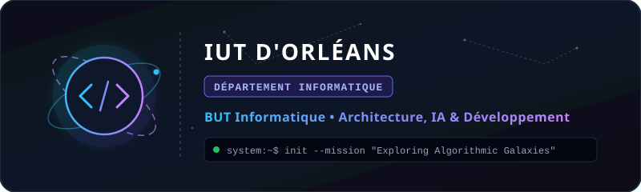

<div align="center">

  <!-- Bannière Logo IUT Orléans Informatique & Thème Cosmique -->
  

  <br/><br/>

  <!-- Animation dactylographique cosmique / programmation -->
  <a href="https://git.io/typing-svg">
    
  </a>

  <br/>

  <!-- Badges de réseaux & liens -->
  <a href="https://emrecan45.github.io" target="_blank">
    
  </a>
  <a href="https://linkedin.com/in/ton-identifiant" target="_blank">
    
  </a>
  <a href="https://discord.com/users/ton-id" target="_blank">
    
  </a>
  <a href="https://itch.io" target="_blank">
    
  </a>

</div>

<br/>

---

### 🛰️ Mission Log & À Propos

```c
struct Developer {
    char name[]          = "Zakaria Makhlouf";
    char baseStation[]   = "IUT d'Orléans (BUT Informatique)";
    char mission[]       = "Mastering software architectures, graphs & AI";
    char coordinates[]   = "Orléans / Fleury-les-Aubrais, France";
    bool readyForLaunch  = true;
};
```

- 🪐 **Formation :** Étudiant en **BUT Informatique** à l'**IUT d'Orléans**, focalisé sur les fondations algorithmiques solides, la programmation orientée objet et les architectures logicielles.
- 🔭 **Explorations en cours :** Graphes & plus courts chemins (BFS, Dijkstra), interfaces réactives JavaFX / MVC, administration réseau & routage (GNS3).
- 🌌 **Ambition :** Concevoir des logiciels performants, explorer les agents d'intelligence artificielle et bâtir des projets numériques complets.

---

### 🛠️ Constellation Technologique

<div align="center">
  
</div>

<br/>

| Domaine | Outils & Technologies |
| :--- | :--- |
| **Langages Core** | Java, Python, JavaScript, SQL, Bash, C |
| **Conception & UI** | JavaFX (MVC), HTML5 / CSS3, Conception relationnelle (Merise / UML) |
| **Infrastructure & Systèmes** | Linux / WSL, GNS3, ACL, DHCP / Routage, Docker, Git & GitHub Actions |
| **Écosystème Numérique** | Shopify, APIs REST, Modèles & Agents IA, E-commerce |

---

### 🌌 Observatoire de Données & Statistiques

<div align="center">

  <!-- Carte GitHub Stats Cosmics -->
  
  
  <!-- Carte Top Langages -->
  

  <br/><br/>

  <!-- Carte Streak Stats Cosmics -->
  

</div>

---

### 🌠 Projets & Systèmes en Orbite

- 🎮 **ColorMage & High Noon** — Jeux web interactifs explorant la logique temps réel et les mécaniques de gameplay.
- 🗺️ **Moteur de Résolution de Graphes** — Application de parcours et de plus court chemin (Dijkstra / BFS).
- 🌐 **Réseau Virtuel GNS3** — Topologie d'entreprise segmentée avec protocoles de routage, DHCP et filtrage par listes de contrôle d'accès (ACL).

---

<div align="center">
  <sub>⚡ <i>"Somewhere, something incredible is waiting to be coded."</i> — Construit avec passion depuis l'IUT d'Orléans.</sub>
</div>
