<div align="center">

  <!-- HUD Header Cyber 3D 🌌 (Fond Stellaire Intégré) -->
  

  <br/><br/>

  <a href="https://git.io/typing-svg">
    
  </a>

  <br/>

  <!-- Console de Communication -->
  <a href="https://mon-portfolio-zakaria-mak.vercel.app/" target="_blank"></a>
  <a href="https://www.linkedin.com/in/zakaria-makhlouf-8a263b309/" target="_blank"></a>
  <a href="mailto:zakaria.makhlouf45000@gmail.com"></a>
  <a href="https://mon-portfolio-zakaria-mak.vercel.app/resume.pdf" target="_blank"></a>

</div>

<br/>

<div align="center">
  
</div>

<!-- ======================= SYS.LOG ======================= -->
<div align="center">
  
</div>

<br/>

> [!NOTE]  
> 📡 **ENCRYPTED_TRANSMISSION:** *"[ DECRYPTING... ] Flottant dans la matrice, chaque algorithme est un réseau de neurones interconnecté, et chaque système est une grille de données lumineuse qui s'active dans l'obscurité numérique."*

```json
{
  "unit_id": "Zakaria Makhlouf",
  "base_station": "IUT Orléans Prime [BUT Informatique - 2ème Année]",
  "directive": "Ingénierie Logicielle Avancée, Algorithmique & Intelligences Artificielles",
  "status_code": "200_OK_ORBITING_COMPLEX_SYSTEMS"
}
```

<div align="center">
  
</div>

<!-- ======================= CORE.MODULES ======================= -->
<div align="center">
  
</div>

<div align="center">
  <br/>
  
  <br/><br/>
</div>

| <kbd>MODULE_CLASS</kbd> | <kbd>ACTIVE_TECHNOLOGIES</kbd> |
| :--- | :--- |
| **🚀 Propulsion Quantique** | `Java`, `Python`, `C`, `JavaScript (JS)` |
| **🧠 Cerveau Positronique** | `Architecture POO`, `Modèles MVC`, `Graphes (Dijkstra / BFS)` |
| **🛰️ Grille d'Infrastructure** | `Linux Kernel`, `Serveurs DHCP`, `Docker Conteneurs` |
| **🛡️ Sécurité & Routage** | `Réseaux GNS3`, `Règles ACL`, `Bases de Données SQL` |

<div align="center">
  <br/>
  
</div>

<!-- ======================= TELEMETRY.DATA ======================= -->
<div align="center">
  
</div>

<br/>

<div align="center">

  
  

  <br/><br/>

  

</div>

<div align="center">
  <br/>
  
</div>

<!-- ======================= SYS.PROJECTS ======================= -->
<div align="center">
  
</div>

<br/>

<table>
  <tr style="background: transparent; border: none;">
    <td width="20%" style="border: none;" align="center">
      
    </td>
    <td width="80%" style="border: none;">
      <h4>💰 <strong>App Gestion Financière + Intelligence Artificielle</strong></h4>
      <code>Java</code> <code>JavaScript</code> <code>APIs</code> <code>LLMs</code><br/><br/>
      Système full-stack avec <kbd>Assistant IA Intégré</kbd> qui analyse en direct et conseille le pilote sur le suivi de ses revenus, le tout sublimé par des interfaces graphiques de Data Viz en orbite.
    </td>
  </tr>
  <tr style="background: transparent; border: none;">
    <td width="20%" style="border: none;" align="center">
      
    </td>
    <td width="80%" style="border: none;">
      <h4>🧠 <strong>Agent IA d'Optimisation PC (Overwatch)</strong></h4>
      <code>Python</code> <code>Data Monitoring</code> <code>Scripting</code><br/><br/>
      Création d'un <kbd>Agent Autonome Intelligent</kbd> s'exécutant en arrière-plan. Il scanne les terminaux de l'environnement, diagnostique les anomalies et déclenche des automatisations d'optimisation en totale indépendance.
    </td>
  </tr>
  <tr style="background: transparent; border: none;">
    <td width="20%" style="border: none;" align="center">
      
    </td>
    <td width="80%" style="border: none;">
      <h4>🧱 <strong>Briqu'IUTO - SAÉ Logicielle Orientée Objet</strong></h4>
      <code>Java (POO)</code> <code>JDBC</code> <code>JavaFX GUI</code><br/><br/>
      Modélisation structurelle d'une <strong>application de gestion de blocs de données LEGO</strong>. Connectée en fibre optique à une base de données MySQL via JDBC, enveloppée d'une console graphique JavaFX ultra-réactive.
    </td>
  </tr>
  <tr style="background: transparent; border: none;">
    <td width="20%" style="border: none;" align="center">
      
    </td>
    <td width="80%" style="border: none;">
      <h4>🌐 <strong>Architecture de Réseau Cyberspace GNS3</strong></h4>
      <code>Serveurs DHCP</code> <code>Protocoles Routage</code> <code>ACLs</code><br/><br/>
      Conception d'une grille d'infrastructure holographique émulée sur <strong>GNS3</strong>. Gère le transfert de paquets inter-quadrants par segmentation rigoureuse et bloque les fléaux grâce à d'épaisses murailles d'accès (ACL).
    </td>
  </tr>
</table>

<div align="center">
  <br/>
  <sub>✨ <kbd>EOF</kbd> <i>"La réalité de notre monde n'est qu'un immense hologramme généré par 1000 lignes de code parfaites."</i> ✨</sub>
</div>
